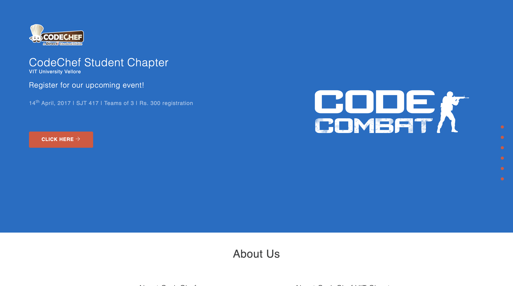

<p align="center"><a href="https://www.codechefvit.com" target="_blank"></a>
</p>

# CodeChef-VIT Website for 2017

> <Subtitle>
The official website of CodeChef-VIT for the year 2017.

---
[](https://codechefvit.github.io/CodeChefVIT/)


## Features
- Displays all information about the Student Chapter.


## Screenshots


## Instructions to run

```
$ git clone https://github.com/CodeChefVIT/CodeChefVIT
$ cd CodeChefVIT
$ live-server
```

## Contributors
- <a href="https://github.com/vinitshahdeo">Vinit Shahdeo</a>

## License

[](http://badges.mit-license.org)

<p align="center">
	With :heart: by <a href="https://www.codechefvit.com" target="_blank">CodeChef-VIT</a>
</p>
